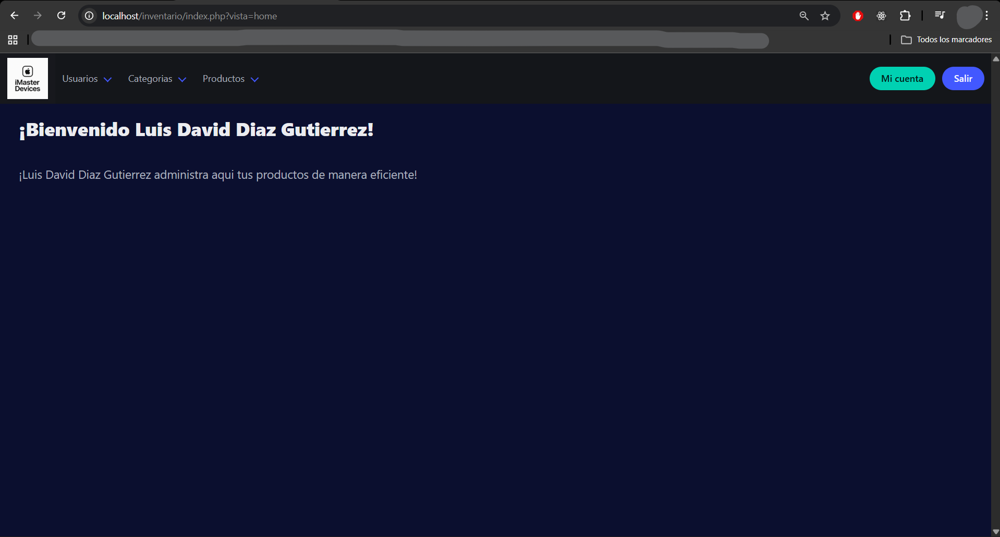
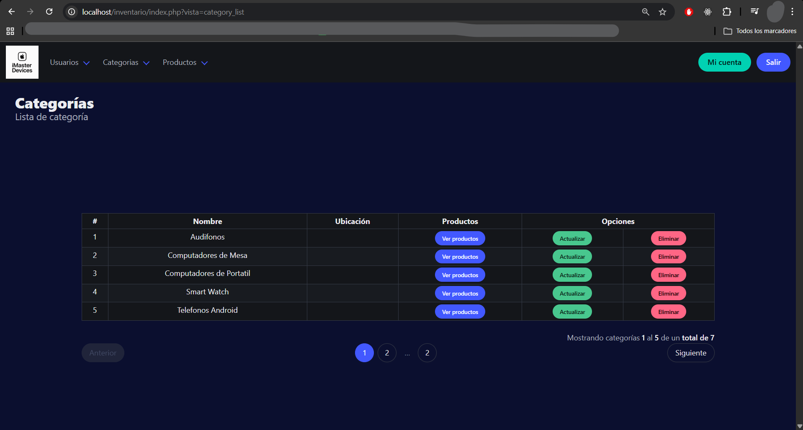
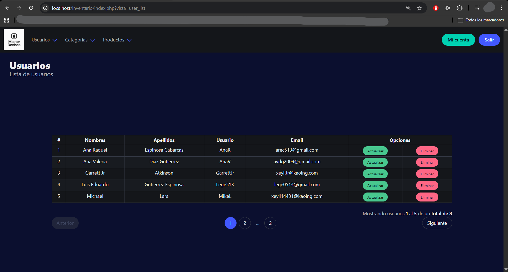

# 📦 Sistema de Inventario

Aplicación web para la gestión de inventarios con control de usuarios, roles y administración de productos.

---

## 🚀 Demo del sistema

### 🔐 Login


---

### 📊 Dashboard


---

### 📦 Gestión de productos


---

### 🗂️ Categorías


---

### 👥 Usuarios


---

## 🧠 Características

- 🔐 Autenticación de usuarios
- 👥 Sistema de roles
- 📦 Gestión completa de productos
- 🗂️ Administración de categorías
- 🖼️ Carga de imágenes
- 📊 Visualización de datos
- 🎨 UI moderna con Bulma

---

## 🛠️ Tecnologías

- PHP
- MySQL
- JavaScript
- HTML5 / CSS3
- Bulma
- XAMPP

---

## ⚙️ Instalación

```bash
git clone git@github-work:LuisDiaz122001/inventario.git

Ubicar en:

C:\xampp\htdocs\

Iniciar Apache y MySQL en XAMPP.

👨‍💻 Autor

Luis Diaz

💼 GitHub: https://github.com/LuisDiaz122001

⭐ Nota

Este proyecto fue desarrollado como parte de mi proceso de aprendizaje en desarrollo web, enfocado en buenas prácticas y gestión de sistemas reales.


---

# 🚀 4. Subir todo

```bash
git add .
git commit -m "README estilo portafolio con capturas"
git push